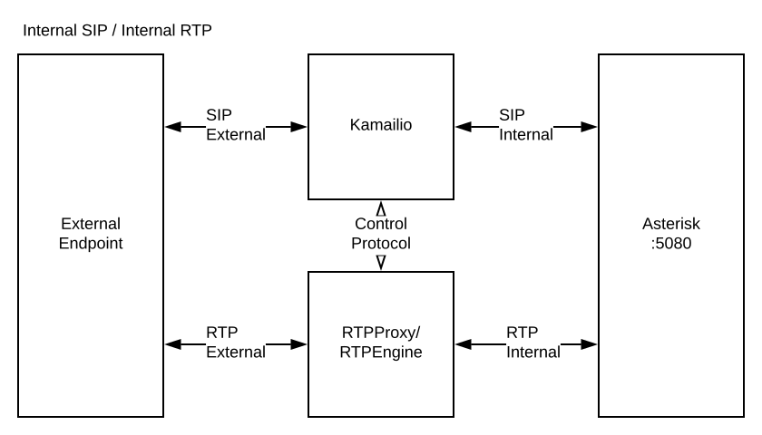

# Asterisk Config

Asterisk Config is a kubernetes sidecar container which constructs the
configuration for Asterisk.  It is comprised of a custom configuration set and a
standardized dynamic environment set to build the Asterisk configuration for the
Pod in question.

The primary dynamic component of Asterisk Config is the IP address (internal and
external) for use by the SIP and PJSIP modules.

## Automatic reloading

Any time dynamic data is updated, Asterisk is told to reload.  By default, we
only reload `res_pjsip.so`, since the dynamic data usually just involves PJSIP
endpoint IPs.  However, you can set the `RELOAD_MODULES` environment variable to
a comma-separated list of modules which should be reloaded when the dynamic data
is updated.

The reloads are performed by executing the ARI "/asterisk/modules" "PUT"
(reload) once for each of the specified modules.  This ARI connection is
automatically created with a randomly-generated password by Asterisk Config.

## Layering

There are two layers of files which are used:

  - Default configuration
  - Custom configuration

### Default configuration

Included within this package is the standard Asterisk basic configuration set
with minimal alterations to:

  - include custom configurations
  - include configuration directories
  - disable all file-based logging

Any file in the default configuration my be replaced by including it in your
custom configuration bundle, but see the Custom configuration section below for
better methods.

The default configuration also creates configurations for ARI, so that it may
call a reload when necessary, and PJSIP, to configure the IP information for
transports.

#### PJSIP default transports

The following default PJSIP transports will be specified:  

  - `k8s-internal-ipv4-internal-media` (internal SIP/signaling advertisement,
    internal RTP/media advertisement, port 5080/UDP)
  - `k8s-internal-ipv4-external-media` (internal SIP/signaling advertisement,
    external RTP/media advertisement, port 5070/UDP)
  - `k8s-external-ipv4-external-media` (external SIP/signaling advertisement,
    external RTP/media advertisement, port 5060/UDP)

In most cloud-based kubernetes setups, the Pod will be assigned an internal IP
address, and it will have a NATed external IP address.  The choice of transports
depends on two things:

  - Where is the _signaling_ endpoint?
  - Where is the _media_ endpoint?

It is common, for instance, to use kamailio as a SIP proxy to handle a scalable
set of Asterisk servers.   In this case, you would want to use _internal_
signaling IPs.  The RTP, however, will depend on whether you want your media to
flow _directly_ to your Asterisk Pods (`-external-media`) or by way of
`rtpengine` or `rtpproxy` (`-internal-media`).

For each of your PJSIP `Endpoints`, just specify the transport you wish to
use.

 - 
 - 
 - 

### Custom configuration

While your custom configurations are allowed to overwrite any Asterisk
configuration file, there are generally two schemes by which customized configurations may be
applied:

  - `<module>.d/XXXX.conf`
  - `<module>_custom.conf`

The most flexible approach is to create any number of discrete files in the
module configuration subdirectories.  For instance, you might add a PJSIP
endpoint configuration in:

`pjsip.d/ext-101.conf`

Any file with the `.conf` extension in one of these directories will
automatically be loaded.

Modules which are configured to load configurations using this scheme are:

  - AMI (`manager.d/`)
  - ARI (`ari.d/`)
  - Extensions (`extensions.d/`)
  - PJSIP (`pjsip.d/`)
  - Voicemail (`voicemail.d/`)

If there is any default configuration for any of these modules, that
configuration will exist in `<extension>_custom.conf`.  The corresponding
`<extension>.conf` only contains include statements.

Take special note that ARI and PJSIP modules are used internally by Asterisk
Config, so changing their root `ari.conf` and `pjsip.conf` is not recommended
unless you really know what you are doing.

## Usage

It is presumed that you have a kubernetes installation on a standard cloud
platform (such as AWS, GCP, Azure, DigitalOcean, etc) or are running a baremetal
kubernetes cluster which you can control to supply the public and private IP
addresses for the Asterisk Pod.

It is strongly recommended to set the `CLOUD` environment variable to match your
environment.  The valid options are:

  - `aws` Amazon Web Services
  - `azure` Microsoft Azure
  - `digitalocean` or `do` Digital Ocean
  - `gcp` Google Cloud Platform

set to one of:


Asterisk Config offers varying levels of configuration complexity, allowing you
to easily just get your Asterisk system off the ground or to build a
fully-templated configuration set.

### Basic Usage

The simplest use is: to create the set of custom Asterisk configurations

  1. create the set of custom Asterisk configurations for your scenario
  2. generate a `.zip` file of that configuration tree
  3. load that `.zip` file to a ConfigMap, Secret, or Web URL

For example:

We will define a simple dialplan with a single PJSIP endpoint to a carrier.
When a call comes in from the carrier, it will be answered and any audio
received will be played back to the caller.

First, create a directory to contain the configuration files.  Files stored in
this directory will be copied into `/etc/asterisk/` on the live Asterisk Pod.
In this example, we will use the local directory named
`/home/user/asterisk/config`.

Inside your directory, we create two files: `pjsip.d/my_carrier.conf` and
`extensions.d/dialin.conf`.

`pjsip.d/my_carrier.conf`:

```ini
[pstn]
type=endpoint
transport=k8s-external-ipv4-external-media
context=dialin
disallow=all
allow=ulaw
aors=pstn
rtp_symmetric=yes

[pstn]
type=aor
contact=sip:my.carrier.com:5060

[pstn]
type=identify
endpoint=pstn
match=12.34.56.78
match=87.65.43.21

[acl]
type=acl
deny=0.0.0.0/0.0.0.0
permit=12.34.56.78/255.255.255.255
permit=87.65.43.21/255.255.255.255
```

`extensions.d/dialin.conf`:

```ini
[dialin]
exten = echo,1,Verbose(1, "Running Echo")
 same = n,Answer()
 same = n,Echo()
 same = n,Hangup()

exten = 15555555555,1,Verbose(1, "Received call to +1 555 555.5555")
 same = n,Goto(echo,1)
```

Now zip up these configuration files to a new `asterisk-config.zip`:

```sh
zip -r asterisk-config.zip *
```

Then store the `asterisk-config.zip` file to kubernetes as a Secret named
"asterisk-config":

```sh
kubectl create secret generic asterisk-config --from-file=asterisk-config.zip
```

**NOTE**:  By default, Asterisk-Config looks for the Secret named
"asterisk-config" to load the custom configuration.  See the section below for
sourcing the custom configuration from a different location.

Now we create a normal Pod spec for kubernetes including the Asterisk
Configuration sidecar container:

```yaml
apiVersion: extensions/v1beta1
kind: Deployment
metadata:
  name: asterisk
  labels:
    component: asterisk
spec:
  replicas: 1
  template:
    metadata:
      labels:
        component: asterisk
    spec:
      hostNetwork: true
      containers:
        - name: config
          image: cycoresystems/asterisk-config
          env:
            - name: POD_NAMESPACE
              valueFrom:
                fieldRef:
                  fieldPath: metadata.namespace
          volumeMounts:
            - name: config
              mountPath: /etc/asterisk
            - name: source
              mountPath: /source
        - name: asterisk
          image: cycoresystems/asterisk
          volumeMounts:
            - name: config
              mountPath: /etc/asterisk
      volumes:
        - name: config
        - name: source
          secret:
            secretName: "asterisk-config"
```


## Custom Configuration source

By default, Asterisk Config looks for the file `/source/asterisk-config.zip` as
the source of configuration.  However, this can be customized by setting the
`SOURCE` environment variable.

You may also obtain the source from an HTTP URL by specifying that URL as the
`SOURCE`.  Additional environment variables may be provided for HTTP authentication:

  - `URL_USERNAME` (for basic authentication)
  - `URL_PASSWORD` (for basic authentication),
  - `URL_AUTHORIZATION` (explicit `"Authorization" header`)

If no `SOURCE` file can be found or is specified, Asterisk Config will attempt to
load the (expanded) configuration tree in the `/custom/` directory.  In this
way, you may plug in your own source-obtaining method and have it populate the
custom configuration files in this directory.

To make sure the Asterisk container is not successfully started before the
configuration can be loaded, Asterisk Config will die if no valid custom
configuration can be obtained.  Asterisk will already die if it cannot find its
configuration.  Kubernetes will automatically restart each of these if they die.

## Templates

Asterisk Config will process any file within the source bundle which ends in the
`.tmpl` extension.  These files will be processed as Go `text/template`
files and the output stored as the same filename without the `.tmpl` extension.

Values for the templates may come from a number of sources:

  - ConfigMap
  - Environment Variables
  - Service
  - Endpoints (of a Service)
  - EndpointIPs (of a Service)
  - Network

### ConfigMap

To obtain ConfigMap entries, Asterisk Config will use the Kubernetes API to
attempt to pull in the ConfigMap and key requested. 

**Format**:  `{{.ConfigMap "<name>" "<namespace>" "<key>"}}` 

The provided namespace _may_ be `""` if both the ConfigMap is in the same
namespace as the Pod _and_ the `POD_NAMESPACE` environment variable is properly
set.

The ConfigMap will be monitored by Asterisk Config, and if it is updated, the
configuration files will be regenerated, and a reload will be performed.

Note that this will likely require an RBAC entry to allow the `ServiceAccount`
under which Asterisk Config is running to access the referenced ConfigMap.


### Environment Variables

**Format**: `{{.Env "<name>"}}`

It is useful to note that IP addresses of services within the same namespace
will automatically be populated as environment variables by kubernetes.  These
will be of the form `<SERVICE_NAME>_SERVICE_HOST`.  For instance, the IP of a
service named "kamailio" will be stored in the environment variable
`KAMAILIO_SERVICE_HOST`.  This is a normal, default feature of all kubernetes
containers.  See the [documentation](https://kubernetes.io/docs/concepts/services-networking/service/) for more information.

### Service

Data from a kubernetes Service may be obtained using the Kubernetes API.

**Format**: `{{.Service "<name>" "<namespace>]"}}`

The provided namespace _may_ be `""` if both the Service is in the same
namespace as the Pod _and_ the `POD_NAMESPACE` environment variable is properly
set.

The value returned here is the Kubernetes
[Service](https://kubernetes.io/docs/reference/generated/kubernetes-api/v1.10/#service-v1-core).
Keep in mind that Go uses PascalCase for the fields, so "clusterIP" becomes
"ClusterIP".

For example, to get the ClusterIP of a service named "kamailio" in the "voip"
namespace:

`{{ with .Service "kamailio" "voip"}}{{.Spec.ClusterIP}}{{end}}`

Note that the IP address of a service within the same namespace can be obtained
more simply by environment variable, as described above.


### Endpoints

Data from the kubernetes Endpoints of a Service may be obtained using the
Kubernetes API.

**Format**: `{{.Service "<name>" "<namespace>"}}`

The provided namespace _may_ be `""` if both the Service is in the same
namespace as the Pod _and_ the `POD_NAMESPACE` environment variable is properly
set.

The value returned is the Kubernetes [Endpoints](https://kubernetes.io/docs/reference/generated/kubernetes-api/v1.10/#endpoints-v1-core).

The Endpoints will be monitored by Asterisk Config, and if it is updated, the
configuration files will be regenerated, and a reload will be performed.

This is usually used to obtain the dynamic set of proxy servers, but since the
most common reason to do this is to obtain the set of IPs for endpoints of a
service, we provide a second helper function just for that.

### Endpoint IPs

One of the most common pieces of dynamic data to retrieve is the set of IPs for
the endpoints of a service.  Therefore, to simplify the relatively tedious
iteration of these directly from the Endpoints spec, we provide the EndpointIPs
macro, which returns the list of IPs of all Endpoints of the given service
name.

**Format**: `{{.EndpointIPs "<name>" "<namespace>"}}`

The provided namespace _may_ be `""` if both the Service is in the same
namespace as the Pod _and_ the `POD_NAMESPACE` environment variable is properly
set.

Using this is then easy.  For example, to create a PJSIP endpoint from the set
of proxy servers running as the "kamailio" service:

`pjsip.d/proxies.conf`:

```ini
[proxies]
type=endpoint
transport=k8s-internal-ipv4-external-media
context=from-proxies
disallow=all
allow=ulaw
aors=proxies
rtp_symmetric=yes

[proxies]
type=aor
{{range .EndpointIPs "kamailio"}}
contact=sip:{{.}}
{{end}}

[proxies]
type=identify
endpoint=proxies
{{range .EndpointIPs "kamailio"}}
match={{.}}
{{end}}

[proxies]
type=acl
deny=0.0.0.0/0.0.0.0
{{range .EndpointIPs "kamailio"}}
permit={{.}}
{{end}}
```

The Endpoints IPs will be monitored by Asterisk Config, and if they are updated, the
configuration files will be regenerated, and a reload will be performed.


### Network data

The IP addresses for the running Pod are made available, as well.

**Format**: `{{.Network "<kind>"}}`

The available data kinds correspond to the data available from
[NetDiscover](https://github.com/CyCoreSystems/netdiscover):

  - "hostname"
  - "privatev4"
  - "publicv4"
  - "publicv6"

Note that PJSIP transports are already automatically set up, as described above.

